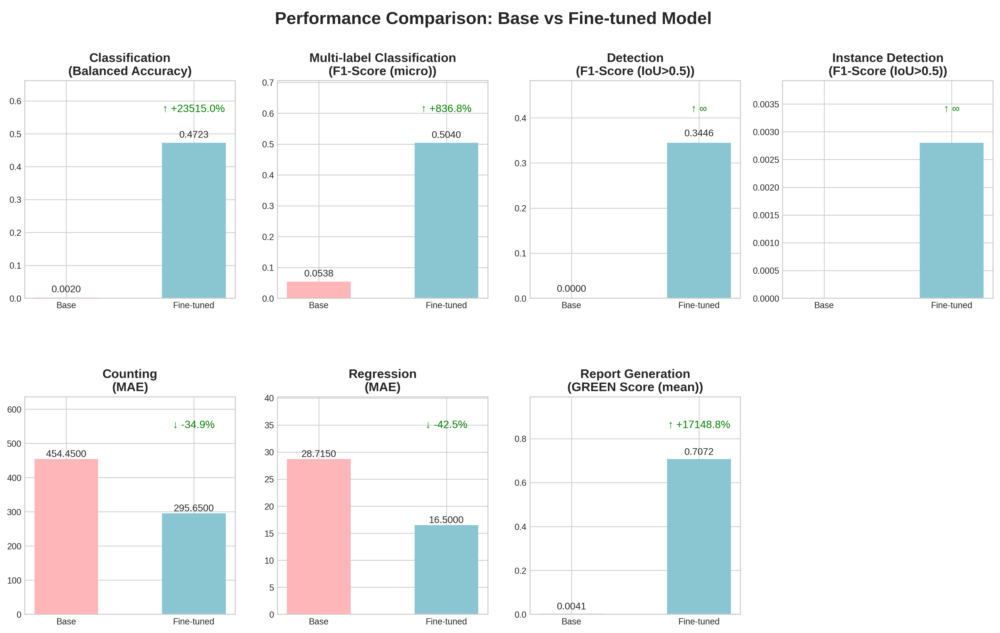

# FLARE25-PaliGemma: Multimodal Medical Image Analysis

[](https://huggingface.co/yws0322/flare25-paligemma2)

This repository provides the official code and model for **FLARE25-PaliGemma**, a vision-language model for medical image question answering and analysis, developed for the FLARE 2025 Task 5 (Medical MLLM 2D track).

---

## Environment and Requirements

- **GPU:** NVIDIA 24GB+ VRAM
- **CUDA:** 11.8 or 12.0+

### Installation
```bash
conda create -n flare25-paligemma2 python=3.10
conda activate flare25-paligemma2
pip install -r requirements.txt
```

---

## Dataset

- **Source:** [FLARE-MedFM/FLARE-Task5-MLLM-2D](https://huggingface.co/datasets/FLARE-MedFM/FLARE-Task5-MLLM-2D)
- **Description:** 19 medical datasets, 8 imaging modalities, 50,996 images, 58,112 Q&A pairs
- **Structure:**
```
original_dataset/
├── training/
├── validation-public/
└── validation-hidden/
```
- **Download:**
```bash
huggingface-cli login
huggingface-cli download FLARE-MedFM/FLARE-Task5-MLLM-2D --repo-type dataset --local-dir ./original_dataset
find original_dataset -name "*.zip" -exec unzip -o "{}" -d "$(dirname "{}")" \;
```

---

## Preprocessing

- **Purpose:**
  - Image validation: Ensures all images can be loaded and converted to RGB
  - Data filtering: Removes invalid samples and applies sampling strategies
  - Format conversion: Converts to HuggingFace Dataset format
  - Split creation: Generates training and validation splits

- **Command:**
```bash
python preprocessing.py \
    --base_dir original_dataset \
    --output_dir processed_dataset
```
- **Options:**
  - `--max_samples`, `--val_ratio`, `--include_datasets`, `--exclude_datasets`

---

## Training

- **Model:** PaliGemma2-10B (LoRA fine-tuned, 4-bit quantization)
- **LoRA config:** r=16, alpha=32, dropout=0.05
- **Optimizer:** Paged AdamW 8-bit
- **Batch size:** 1 (gradient accumulation 32)

**To train from scratch:**
```bash
python finetune.py \
    --model_id google/paligemma2-10b-pt-224 \
    --train_data_path processed_dataset/train \
    --val_data_path processed_dataset/validation \
    --output_dir fintuned_paligemma2 \
    --num_train_epochs 3 \
    --per_device_train_batch_size 1 \
    --gradient_accumulation_steps 32 \
    --learning_rate 5e-5 \
    --warmup_ratio 0.03 \
    --lora_r 16 \
    --lora_alpha 32 \
    --lora_dropout 0.05 \
    --save_steps 100 \
    --eval_steps 100 \
    --logging_steps 10
```

**To resume training from a checkpoint:**
```bash
python finetune.py \
    --model_id google/paligemma2-10b-pt-224 \
    --train_data_path processed_dataset/train \
    --val_data_path processed_dataset/validation \
    --output_dir fintuned_paligemma2 \
    --num_train_epochs 3 \
    --per_device_train_batch_size 1 \
    --gradient_accumulation_steps 32 \
    --learning_rate 5e-5 \
    --warmup_ratio 0.03 \
    --lora_r 16 \
    --lora_alpha 32 \
    --lora_dropout 0.05 \
    --save_steps 100 \
    --eval_steps 100 \
    --logging_steps 10 \
    --resume_from_checkpoint \
    --checkpoint_path fintuned_paligemma2/checkpoint-500
```

---

## Inference

- **Command:**
```bash
python inference.py \
    --base_dataset_path original_dataset \
    --validation_type public \
    --checkpoint_path fintuned_paligemma2/checkpoint-best
```
- **Output:** predictions_public.json

---

## Evaluation

- **Command:**
```bash
python eval.py \
    --base_dataset_path original_dataset \
    --prediction_file predictions_public.json \
    --output_dir evaluation_results \
    --output_filename metrics_public.json
```
- **Metrics:**
  - Classification: Balanced Accuracy
  - Multi-label: F1-Score (micro)
  - Detection: F1-Score (IoU>0.5)
  - Instance Detection: F1-Score (IoU>0.5)
  - Counting/Regression: MAE
  - Report Generation: GREEN Score

---

## Results

Below is a comparison of the main evaluation metrics between the base (pretrained) model and the fine-tuned model on the FLARE25 validation set.



| Task Type                  | Metric                | Base Model | Fine-tuned Model | #Examples        |
|----------------------------|----------------------|------------|------------------|-------------------|
| Classification             | Balanced Accuracy    | 0.0020     | 0.4723           | 3513              |
| Multi-label Classification | F1-Score (micro)     | 0.0538     | 0.5040           | 1446              |
| Detection                  | F1-Score (IoU>0.5)   | 0.0000     | 0.3446           | 255               |
| Instance Detection         | F1-Score (IoU>0.5)   | 0.0000     | 0.0028           | 176               |
| Counting                   | MAE                  | 454.4500   | 295.65           | 100               |
| Regression                 | MAE                  | 28.7150    | 16.50            | 100               |
| Report Generation          | GREEN Score (mean)   | 0.0041     | 0.7072           | 1945              |

The fine-tuned model shows substantial improvements across all tasks, especially in classification, multi-label, detection, and report generation.

---

## Docker Usage

We provide a pre-built Docker image for easy deployment and testing. The Docker image contains all necessary dependencies and the fine-tuned model.

### Option 1: Load from tar.gz file (Recommended)

Download the [pre-built Docker](https://drive.google.com/file/d/1M1MQU27g11tcd3tP9cuXfm7kxAOxgqUI/view?usp=drive_link) image and load it:

```bash
# Download the Docker image (provided separately)
# docker load -i flare25-paligemma2.tar.gz
docker load -i flare25-paligemma2.tar.gz
```

### Option 2: Build from source

**Docker files:**
```
docker/
├── Dockerfile              # Docker image definition
├── requirements.txt        # Python dependencies  
├── inference.py            # Main inference script
├── download_models.py      # Model download utility
└── predict.sh             # Inference execution script
```

```bash
# Navigate to docker directory
cd docker

# Build the Docker image with Hugging Face token
docker build -f Dockerfile -t flare25-paligemma2 \
    --build-arg HUGGINGFACE_TOKEN=your_hf_token_here .
```

### Running Inference

Prepare your [demo test data](https://drive.google.com/file/d/1QJcfTajYxqbpqqS1mVtUN6Phc8c1dUhV/view?usp=drive_link) in the `test-fake/` directory and run:

```bash
# Create output directory
mkdir -p flare25-paligemma2_output

# Run inference on demo images  
docker container run \
    --gpus "device=0" \
    -m 28G \
    --name flare25-paligemma2 \
    --rm \
    -v $PWD/test-fake/:/workspace/inputs/ \
    -v $PWD/flare25-paligemma2_output/:/workspace/outputs/ \
    flare25-paligemma2:latest \
    /bin/bash -c "sh predict.sh"
```

**Note:** The Docker container expects:
- Input data mounted to `/workspace/inputs/`
- Output directory mounted to `/workspace/outputs/` 
- Input should follow the validation-hidden structure with JSON files and `imagesTs/` directories

### Input/Output Format

**Input format** (JSON):
```json
[
  {
    "ImageName": "imagesTs/image1.png",
    "Question": "What abnormalities are visible in this image?",
    "TaskType": "classification",
    "Answer": ""
  }
]
```

**Output format** (JSON):
```json
[
  {
    "ImageName": "imagesTs/image1.png", 
    "Question": "What abnormalities are visible in this image?",
    "TaskType": "classification",
    "Answer": "Pneumonia detected in the right lung"
  }
]
```

### System Requirements

- Docker with GPU support (nvidia-docker2)
- NVIDIA GPU with 24GB+ VRAM
- 28GB+ RAM allocation
- CUDA 11.8 or 12.0+

### Save Docker Image

To create a distributable tar.gz file:

```bash
# Save the Docker image to tar.gz
docker save flare25-paligemma2:latest | gzip -c > flare25-paligemma2.tar.gz
```

### Notes

- **Hugging Face Token Required**: PaliGemma2 is a gated model requiring HF authentication
- The Docker image includes the fine-tuned model weights
- Input images should be placed in `test-fake/` directory following validation-hidden structure
- Results will be saved in `flare25-paligemma2_output/` directory  
- Run `chmod -R 777 ./*` if you encounter permission issues
- Docker image size: ~15-20GB (includes model weights)
- The `predict.sh` script automatically runs inference on all JSON files in `/workspace/inputs/`
- Model download happens during Docker build (requires internet connection)

---

## Model Download & Usage

- **Hugging Face Model Card:** [yws0322/flare25-paligemma2](https://huggingface.co/yws0322/flare25-paligemma2)

```python
from transformers import PaliGemmaProcessor, PaliGemmaForConditionalGeneration
from peft import PeftModel
from PIL import Image
import torch

base_model_id = "google/paligemma2-10b-pt-224"
model_id = "yws0322/flare25-paligemma2"

processor = PaliGemmaProcessor.from_pretrained(base_model_id)
base_model = PaliGemmaForConditionalGeneration.from_pretrained(
    base_model_id,
    torch_dtype=torch.bfloat16,
    device_map="auto",
    load_in_4bit=True
)
model = PeftModel.from_pretrained(base_model, model_id)

image = Image.open("chest_xray.jpg")
question = "What are the key findings in this chest X-ray?"
image_token = "<image>"
prompt = f"{image_token * processor.image_seq_length}{processor.tokenizer.bos_token}Analyze the given medical image and answer the following question:\nQuestion: {question}\nPlease provide a clear and concise answer."
inputs = processor(images=image, text=prompt, return_tensors="pt")
with torch.no_grad():
    outputs = model.generate(**inputs, max_new_tokens=512, do_sample=False)
response = processor.tokenizer.decode(outputs[0], skip_special_tokens=True)
print(response)
```

---

## Citation

If you use this code, please cite:
```bibtex
@misc{FLARE25-PaliGemma,
  title={FLARE25-PaliGemma},
  author={Yeonwoo Seo},
  year={2025},
  publisher={GitHub}
  url={\url{https://github.com/medfm-flare/FLARE25-PaliGemma}}
}
```

---

## License

This project is licensed under the Apache License 2.0. See the [LICENSE](LICENSE) file for details.
